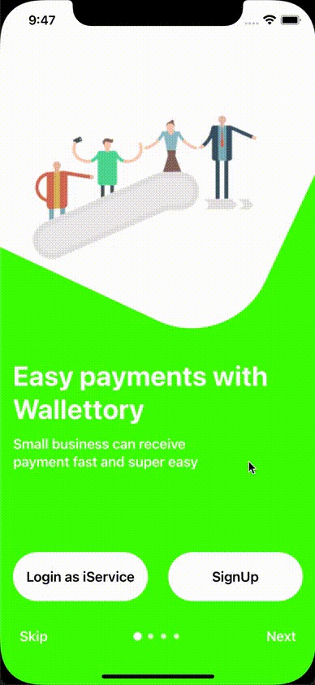

# Onboarding Screen Demo
Demonstrates onboarding screens based on SwiftUI with animations based on [KavSoft](https://kavsoft.dev) work.

I have changed the original work a bit to support a view model to decople a UI transformation logic from a view and of cource assets have been changed to open sourced ones taken from [pngwing](pngwing.com).
The idea of this visual effect is simple: create a rounded rect behind the image and rotate it according to a scrol view offset. The background color is also animated according to scroll view offset. Together it creates such an interesting visual effect.
